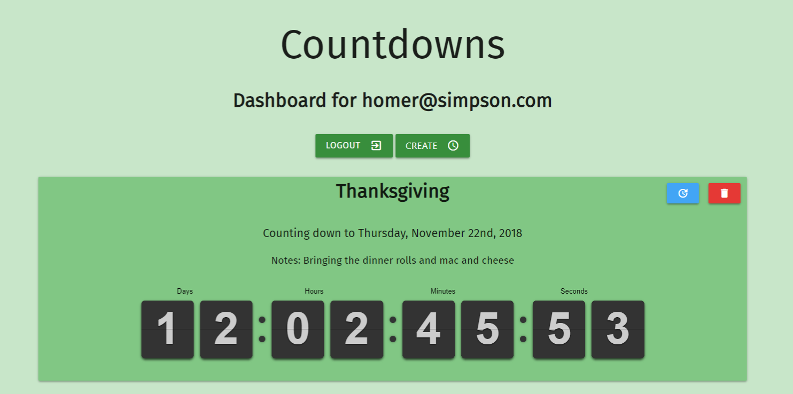

# Countdown

## Link to App

[Countdown](https://countdown-thinkful.herokuapp.com/)

## Summary

Countdown is for people who want to track how long it will be until a certain date arrives so as to track when an event or multiple events happen. If you find yourself constantly having to google when a movie/game/book will be released and don't want to scroll through your calendar to see what date you've added your reminder to, this app is for you.

Each user will create an account and have a dashboard containing all countdowns they have created. Users will be able to create, update, and delete their countdowns. Once created, a countdown will display a clock which will actively count down to the date chosen to the second.

## API Documentation

[API Docs](https://app.swaggerhub.com/apis-docs/spartanindc/Countdown/1.0.0)

## Technology used

- HTML
- CSS
- JavaScript
- jQuery
- Node.js
- MongoDB
- Mongoose
- Express
